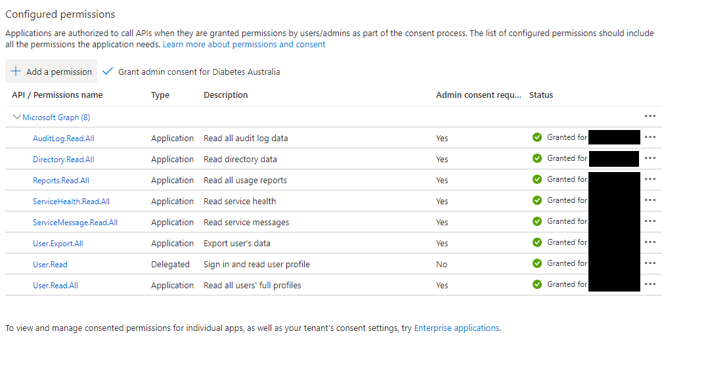

# 03.01 IT Operational Metrics - ReadMe

## Purpose: Provide IT security & CIO with a single source of all their IT security metrics
This stops IT from having to go into multiple different security provider sites/applications and collate all their metrics. 

We'll leverage one PowerBI dataset/model which consolidates all these sources

#### Current state of the dashboard, as presented to Executives:
- Metrics /data are extracted manually
    - Metrics are "as of <date>" (point in time)
- All these sources then get integrated inside a PowerPoint presentation

## Datasets included in BI report
- MS Graph
    - Security
    - Licenses
    - Users
    - Alerts
    - Groups

## Measures and Calculations

## Pages
Page number     |   Image
----------------|---------
Landing page    |  
Yesterday's security position   |    
Guest users in tenancy  |   
License consumption and allocation  |   
User profiles   |   
Security Alerts |   
Drill-through page: given day's score   |   
Drill-through page: metric definitons   |   
Drill-through page: guest user profile   |   


## MS Graph API set up
### Configuring source dataflow
#### Concept tutorials:
1. Good tutorial, with a minor error: 
    - https://techpeanuts.wordpress.com/2020/05/28/connecting-power-bi-to-microsoft-graph/
    Error: This tutorial's example API call of `/me` won't work if you set up the API in the way explained _(delegated)_, as it does not run as an impersonated user, and the `/me` command returns information about the (impersonated) user!! 
    _I wasted a few minutes trying to figure this one out_
    You do want delegated perms, so follow the tute, just use a diff API call. 
0.  Lower quality tute, but still good reading:
    - https://minkus.medium.com/easily-connecting-between-power-query-power-bi-and-microsoft-graph-72333eb95a35

#### Steps
1. Set up an App registration for your application - name it something link "PowerBI to Graph"
    Links:   
    - Primary tutorial: https://www.eginnovations.com/documentation/Office-365/Registering-MS-Graph-App-On-Azure-AD.htm
    - MS offical guide: https://learn.microsoft.com/en-us/entra/identity-platform/quickstart-register-app
    
0. Give that app API permissions, allowing it to call specific API functions
	Links: 
    - MS guide to adding perms: https://learn.microsoft.com/en-us/entra/identity-platform/quickstart-configure-app-access-web-apis
0. Should now see something like this in your App's perms:
    

### Connection inside PowerBI
#### Steps for connecting to MS Graph
1. Make query to MS login API, asking for an access token
    ```powerquery
    makeToken = (#"Azure Graph API Url" as any, #"Azure Tenant ID" as any, #"Azure Application ID" as any, #"Azure Application Client Secret" as any) => let
        loginURL = "https://login.microsoftonline.com/",
        TokenUri = #"Azure Tenant ID" & "/oauth2/token", // which domain is this a token for
        ResourceId = #"Azure Graph API Url", // where is this token for
        TokenResponse = Json.Document(
            Web.Contents(loginURL
			    , [RelativePath = TokenUri
			    , Content = Text.ToBinary(Uri.BuildQueryString([client_id = #"Azure Application ID", resource = ResourceId, grant_type = "client_credentials", client_secret = #"Azure Application Client Secret"]))
				    , Headers = [Accept = "application/json"], ManualStatusHandling = {400}
			    ]
            ) // end web contents
        ), // end json
        generatedToken = TokenResponse[access_token] // assign token value
    in
    generatedToken,
    ```
0. Get token from that API return
    ```powerquery
    myToken = makeToken(
                        #"Azure Graph API Url"
                        , #"Azure Tenant ID"
                        , #"Azure Application ID"
                        , #"Azure Application Client Secret"
                    ) // end makeToken
    ```
0. Use this token in HTTP requests to MS graph
    ```powerquery
    // Ping API for json
    Source = Json.Document(
        Web.Contents(
            #"Azure Graph API Url"
            , [
                RelativePath = "beta/security/secureScores"
                , Headers = [
                    Authorization = "Bearer " 
                    &  myToken
                ]
            ]
        )
    ), 
    value = Source[value],
    ```
    

#### Pagination of queries
Some queries exceed the amount of information an API return shoulod contain. These need to be "paginated", aka repeated, asking for the next bit of info. 
MS uses `odata` style for it's pagination, a fairly simple method, that just requires you to ask for the next odata-link. 
- Here we define a function that will use a paginated query to fetch all users.
We reference the `@odata.nextLink` element of the returned `Source` object for the try-catch in this recursive function. 
```powerquery
// Define a Function Called GetUserDetail that takes a single parameter Path; the MS Graph API Endpoint
    GetUserDetail = (queryPath)=>
    let
    // call out to the web endpoint and convert the result to a JSON
    // Document object which is saved in the Source variable
    Source = Json.Document(
                Web.Contents(
                    #"Azure Graph API Url"
                    , [RelativePath = queryPath, Headers = [Authorization = "Bearer " & myToken]]
                )
            ),
    // Assign the resultant List object (API return) to NextList variable
    NextList= @Source[value],
    nextLink = Text.AfterDelimiter(Source[#"@odata.nextLink"], #"Azure Graph API Url"), 
    // recursively call GetUserDetail function using the value of the @odata.nextLink as the path
    // Since @odata.nextLink is not guaranteed to always exist in the case where the result is less than 100 we need to catch this and deal with it
    // using a try otherwise basically means if you error out because no
    // @odata.nextLink exisit then just return the resulting list of values you did get
    // there is an API returned value called @odata.nextLink - so we can directly reference that
    result = try @NextList & @GetUserDetail(nextLink) otherwise @NextList
    in
    // Return the result variable as the function return
    result,
// Use the function GetUserDetail with the initial path to the object.
// The function will run recursively until it gets all the record and then
// loads the full result to UserDetail Variable  
UserDetail = GetUserDetail("beta/users?$"),
```