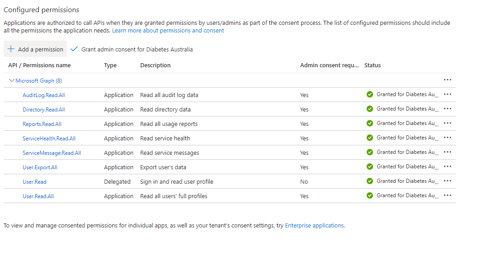

# MS Graph API
## Set up: 
https://www.eginnovations.com/documentation/Office-365/Registering-MS-Graph-App-On-Azure-AD.htm

1. Set up an App registration for your application - name it something link "PowerBI to Graph"
	https://learn.microsoft.com/en-us/entra/identity-platform/quickstart-register-app
0. Give that app API permissions, allowing it to call specific API functions
	https://learn.microsoft.com/en-us/entra/identity-platform/quickstart-configure-app-access-web-apis

Tutorials:
- https://minkus.medium.com/easily-connecting-between-power-query-power-bi-and-microsoft-graph-72333eb95a35
- https://techpeanuts.wordpress.com/2020/05/28/connecting-power-bi-to-microsoft-graph/

Token generation / use:
1. Make query to MS login API
0. Get token from that API return
0. Use this token in HTTP request to MS graph
